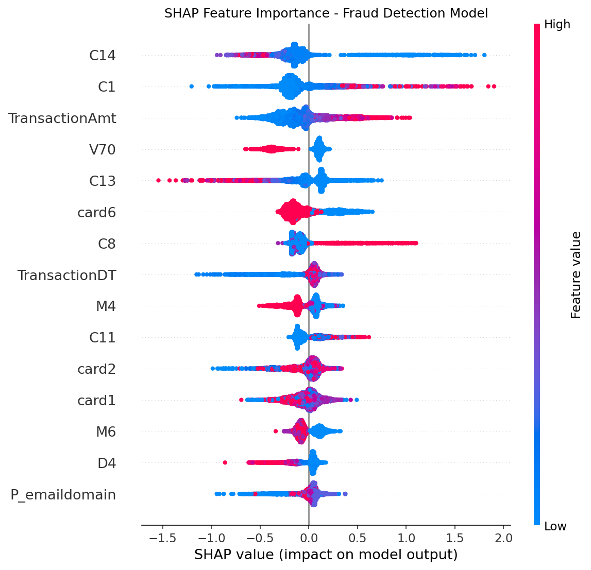
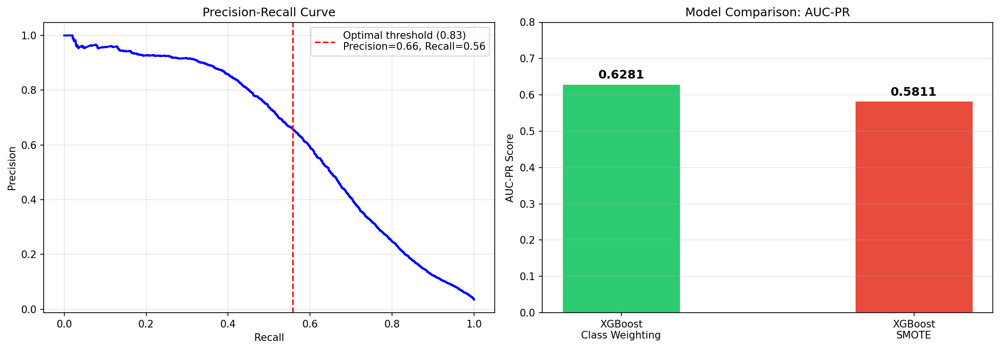

# 🔍 Financial Transaction Fraud Detection System

A production-inspired, end-to-end fraud detection system built on the IEEE-CIS Fraud Detection dataset. This project replicates real-world transaction monitoring workflows used by financial institutions, combining classical ML with modern explainability techniques and business impact quantification.

---

## 📌 Project Overview

Credit card fraud causes billions in losses annually. This project builds a behavioral fraud detection system that:
- Identifies fraudulent transactions in real time with high precision
- Compares imbalance-handling strategies (SMOTE vs cost-sensitive learning)
- Optimizes decision thresholds for operational viability
- Explains model decisions using SHAP values
- Quantifies business impact in dollar terms

---

## 📂 Dataset

**Source:** [IEEE-CIS Fraud Detection — Kaggle](https://www.kaggle.com/competitions/ieee-fraud-detection/data)

| Property | Value |
|---|---|
| Total transactions | 590,540 |
| Raw features | 434 (after merging transaction + identity files) |
| Fraud rate | 3.5% (~20,663 fraud cases) |
| Class imbalance ratio | ~28:1 (non-fraud : fraud) |

The dataset consists of two files merged on `TransactionID`:
- `train_transaction.csv` — core transaction features (V-features, C-features, D-features, amounts)
- `train_identity.csv` — device and identity features (id_ columns)

---

## 🏗️ Project Structure

```
fraud-detection/
│
├── data/
│   ├── train_transaction.csv
│   ├── train_identity.csv
│   ├── test_transaction.csv
│   └── test_identity.csv
│
├── notebooks/
│   └── fraud_detection.ipynb      # Main notebook — full pipeline
│
├── fraud_shap_summary.png         # SHAP feature importance plot
├── fraud_model_summary.png        # Precision-Recall curve + model comparison
└── README.md
```

---

## 🔬 Methodology

### 1. Data Loading & Merging
- Loaded transaction (590,540 rows, 394 features) and identity (144,233 rows, 41 features) files
- Merged on `TransactionID` using a left join to preserve all transactions
- Confirmed fraud rate of 3.5% post-merge

### 2. Data Cleaning & Feature Engineering
- Dropped 214 columns with >50% missing values — primarily sparse identity features
- Retained 218 features after cleaning
- Filled remaining numeric nulls with column medians
- Label-encoded 9 categorical features: `ProductCD`, `card4`, `card6`, `P_emaildomain`, `M1`, `M2`, `M3`, `M4`, `M6`
- Zero missing values in final feature matrix

### 3. Train/Test Split
- 80/20 stratified split preserving fraud rate in both sets
- Training set: 472,432 transactions (16,530 fraud)
- Test set: 118,108 transactions (4,133 fraud)

### 4. Handling Class Imbalance — Two Approaches Compared

**Approach 1 — Cost-Sensitive Learning (Class Weighting):**
- Computed `scale_pos_weight = 27.58` (ratio of non-fraud to fraud cases)
- Passed directly to XGBoost — no data modification required
- Keeps original fraud patterns intact

**Approach 2 — SMOTE Oversampling:**
- Applied Synthetic Minority Oversampling Technique
- Balanced training set to 455,902 vs 455,902 (911,804 total)
- Creates synthetic fraud samples by interpolating between existing ones

### 5. Model Training

Both models used identical XGBoost hyperparameters:
```python
XGBClassifier(
    n_estimators=300,
    max_depth=6,
    learning_rate=0.05,
    eval_metric='aucpr',
    tree_method='hist',
    random_state=42
)
```

### 6. Threshold Optimization
- Default threshold of 0.5 produced 11,096 false positives — operationally unacceptable
- Swept precision-recall curve to find F1-maximizing threshold
- Optimal threshold: **0.83** — reduced false alarms by 89%

### 7. SHAP Explainability
- Applied TreeExplainer on 5,000 test samples
- Identified top behavioral fraud drivers
- Generated summary plot for stakeholder interpretation

---

## 📊 Results

### Model Comparison — AUC-PR (Primary Metric)

> **Why AUC-PR over ROC-AUC?**  
> With 96.5% of transactions being legitimate, ROC-AUC is misleading — a naive model predicting "no fraud" scores well. AUC-PR focuses specifically on minority class (fraud) detection performance.

| Model | AUC-PR | ROC-AUC |
|---|---|---|
| XGBoost + Class Weighting | **0.6281** ✅ | 0.9323 |
| XGBoost + SMOTE | 0.5811 | — |

**Class weighting outperforms SMOTE by 0.047 AUC-PR points.**

Why? SMOTE creates synthetic fraud samples through interpolation between existing fraud cases. However, fraud patterns are highly irregular and non-linear — synthetic interpolated samples introduce noise rather than signal, confusing the model.

---

### Threshold Optimization Impact

| Threshold | F1 Score | Precision | Recall | False Positives | False Negatives |
|---|---|---|---|---|---|
| Default (0.50) | 0.361 | 0.232 | 0.812 | 11,096 | 779 |
| Optimal (0.83) | **0.605** | **0.662** | 0.557 | **1,177** | 1,831 |

Raising the threshold from 0.5 to 0.83:
- **F1 improved by 67.6%** (0.361 → 0.605)
- **False alarms reduced by 89%** (11,096 → 1,177)
- Trade-off: Recall drops from 81.2% to 55.7% — acceptable for high-precision fraud operations

---

### SHAP Feature Importance — Top 15



| Rank | Feature | Mean SHAP | Interpretation |
|---|---|---|---|
| 1 | C14 | 0.257 | Count of addresses linked to card — multiple addresses signal fraud |
| 2 | C1 | 0.226 | Count of payment accounts linked to card |
| 3 | TransactionAmt | 0.215 | Fraudulent transactions cluster at unusual amounts |
| 4 | V70 | 0.199 | Vesta velocity feature — transaction frequency signal |
| 5 | C13 | 0.183 | Count of unique banks associated with card |
| 6 | card6 | 0.180 | Card type (debit/credit) — fraud rates differ significantly |
| 7 | C8 | 0.133 | Billing address count |
| 8 | TransactionDT | 0.127 | Timestamp — fraud peaks at unusual hours |
| 9 | M4 | 0.119 | Match status between transaction and card data |
| 10 | C11 | 0.111 | Login attempts count |

**Key insight:** The top fraud signals are behavioral count features (C14, C1, C13) — suggesting fraudsters use stolen cards across multiple accounts and addresses. This aligns with real-world card testing and account takeover patterns.

---

### Business Impact (Test Set)

| Metric | Value |
|---|---|
| Average fraudulent transaction amount | $149.24 |
| Fraud cases correctly identified | 2,302 |
| **Estimated fraud loss prevented** | **$343,561** |
| False alarm handling cost (est. $5/case) | $5,885 |
| **Net model value** | **$337,676** |
| Total fraud exposure in test set | $616,829 |
| **% of fraud exposure captured** | **55.7%** |

---

## 📈 Visualizations

### Precision-Recall Curve & Model Comparison


---

## 🛠️ Tech Stack

| Category | Tools |
|---|---|
| Language | Python 3.9 |
| ML Modeling | XGBoost, Scikit-learn |
| Imbalance Handling | imbalanced-learn (SMOTE) |
| Explainability | SHAP (TreeExplainer) |
| Data Processing | Pandas, NumPy |
| Visualization | Matplotlib, Seaborn |
| Environment | VS Code, Jupyter Notebook |

---

## 🚀 How to Run

```bash
# Clone the repository
git clone https://github.com/yourusername/fraud-detection.git
cd fraud-detection

# Create virtual environment
python3 -m venv venv
source venv/bin/activate

# Install dependencies
pip install pandas numpy matplotlib seaborn scikit-learn xgboost shap imbalanced-learn jupyter ipykernel

# Download dataset from Kaggle
# Place train_transaction.csv and train_identity.csv in /data folder

# Run notebook
jupyter notebook notebooks/fraud_detection.ipynb
```

---

## 💡 Key Learnings & Interview Insights

**1. AUC-PR is the right metric for imbalanced fraud detection**
ROC-AUC inflates performance on imbalanced datasets. AUC-PR gives an honest picture of minority class detection.

**2. Class weighting beats SMOTE on this dataset**
SMOTE's interpolation assumption breaks down for highly irregular fraud patterns. Cost-sensitive learning respects the original data distribution.

**3. Threshold optimization is a business decision, not just a technical one**
The right threshold depends on the cost of false positives vs false negatives. For fraud, false positives mean blocking legitimate customers — a major UX and revenue concern.

**4. SHAP reveals behavioral fraud signatures**
Count features (C14, C1, C13) dominate — fraudsters leave traces through multiple accounts, addresses, and banks linked to a single card. This aligns with real card testing and ATO (Account Takeover) attack patterns.

**5. Business framing matters as much as model performance**
A model that prevents $343,561 in fraud with only $5,885 in operational costs tells a clearer story to stakeholders than an AUC score alone.

---

